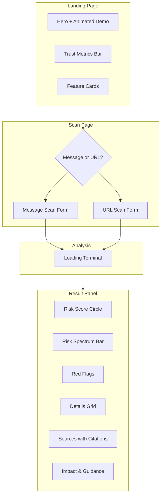
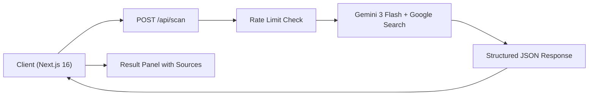

# Wave — AI-Powered Scam Detection Assistant

## Overview

Wave is a real-time scam and risk detection web app. Users paste a suspicious message or URL and get a structured risk report — scam type, red flags, confidence score, and actionable next steps — in under 3 seconds. Built for the Philippine market, it natively understands Taglish (Tagalog-English mix) alongside English.

**Stack:** Next.js 16, React 19, TypeScript, Tailwind CSS v4, Google Gemini 3 Flash, Upstash Redis

---

## Problem

Scams on Facebook, Telegram, GCash, and WhatsApp are extremely common in the Philippines. Most people don't know where to check if a message or link is dangerous. Existing tools are either too technical (domain inspectors, header analyzers) or only work in English, missing local scam patterns and Taglish phrasing.

Wave needed to be: zero-friction (no sign-up), fast (under 5 seconds), multilingual, and scannable at a glance.

---

## Design System

Dark, forest-inspired theme with a muted charcoal-navy primary. Every visual token lives in `src/app/globals.css` — no hardcoded hex values in components.

| Token | Value | Role |
|---|---|---|
| `--background` | #070a08 | Deep pine base |
| `--foreground` | #f5f4f0 | Warm off-white text |
| `--primary` | #4a6a8a | Muted steel (buttons, links) |
| `--accent-brand` | #5a7d6c | Natural pine counterpoint |
| `--safe` → `--danger` | Green → Red | 5-tier risk spectrum |

Five risk levels (Safe, Low Risk, Caution, Suspicious, High Risk) each have dedicated color, dim, border, and glow tokens for consistent use across the result panel.

[screenshot of landing page hero showing the dark forest theme, animated demo card, and CTA buttons]

---

## Design Process

### Information Architecture

### Key Decisions

1. **Risk-first layout** — The circular score and risk level label are the most prominent elements in the result. Color tells the story before text.

[screenshot of scan result panel showing circular risk indicator and risk level badge]

2. **Terminal loading** — Instead of a generic spinner, a step-by-step terminal animation shows what Wave is doing (parsing → language check → pattern analysis → scoring). Makes the 2-3 second wait feel transparent and purposeful.

[screenshot of loading terminal animation with progress bar and analysis steps]

3. **Structured AI output** — Gemini returns strictly typed JSON (risk_score, red_flags array, scam_type, recommendation, etc.), so the frontend renders from a predictable schema — no fragile text parsing.

4. **Taglish-aware detection** — Wave detects whether input is English, Filipino, or Taglish and adapts its analysis. The UI shows which language was detected.

5. **Google-grounded sources** — Every scan cites real Google Search results, shown in a "Sources" card. Users can click through to verify the references.

[screenshot of Sources section showing cited links with domain names]

6. **Privacy-first** — No accounts, no server-side storage. Input is processed and discarded. The scan form explicitly states this.

7. **Graceful rate limiting** — Dual per-minute/per-day limits with human-friendly error messages and retry timers.

---

## Features

- **Message scan** — Paste suspicious text from Facebook, Telegram, Email, WhatsApp, LinkedIn, SMS
- **URL scan** — Check links for phishing, redirect chains, suspicious domains
- **Image attachment** — Attach screenshots for visual inspection (fake logos, spoofed sender names)
- **5-tier risk scoring** — Safe → Low Risk → Caution → Suspicious → High Risk
- **Red flag analysis** — Specific scam patterns with contextual explanations
- **Actionable guidance** — What could happen + what to do next
- **Google Search grounding** — Cited sources for every scan
- **Rate limiting** — 10/min, 50/day per IP (configurable)

---

## Architecture

The scan store is client-side only — no database, no user accounts. The API route handles input validation, rate limiting (in-memory for dev, Upstash Redis for production), and proxies to Gemini with a strict response schema.

---

## Constraints

- **No authentication** — All rate limiting is IP-based, which can false-positive on shared networks
- **AI output variance** — Even with a structured schema, Gemini can return contradictory fields (risk level vs. risk score). A `reconcileRiskLevel` function triangulates them
- **Latency** — Gemini + Google Search grounding takes 2-3 seconds. The terminal animation buys perceived performance
- **Image size** — Screenshots are base64-encoded and sent inline; very large images may hit API limits

---

## API Integration

Wave uses **Google Gemini 3 Flash** with:

- **`responseSchema`** — A strict JSON schema with 11 required fields and enum constraints, forcing Gemini to return predictable structured data
- **`googleSearch` tool** — Grounds every scan with live web results
- **Safety settings** — Per-category thresholds (harassment, hate speech, sexually explicit, dangerous content)
- **Temperature 0.2** — Low creativity for consistent, deterministic analysis
- **Taglish prompt engineering** — The system prompt explicitly instructs Gemini to detect and respond in the user's language and match the appropriate tone (Formal, Casual, Warning)
